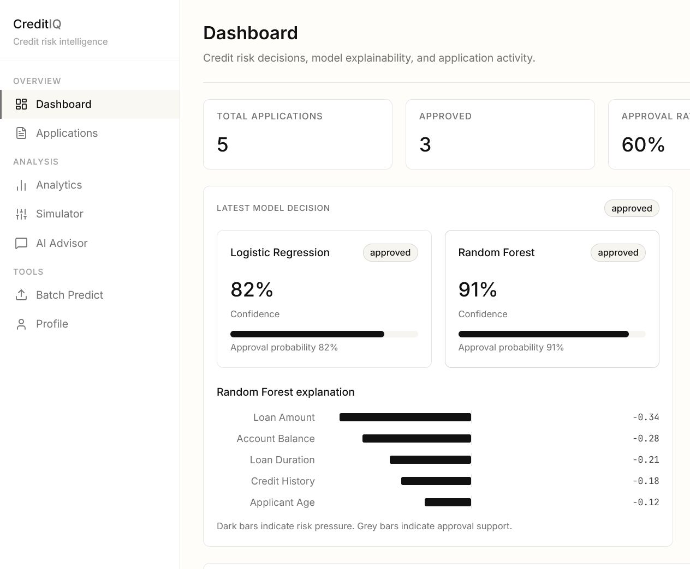
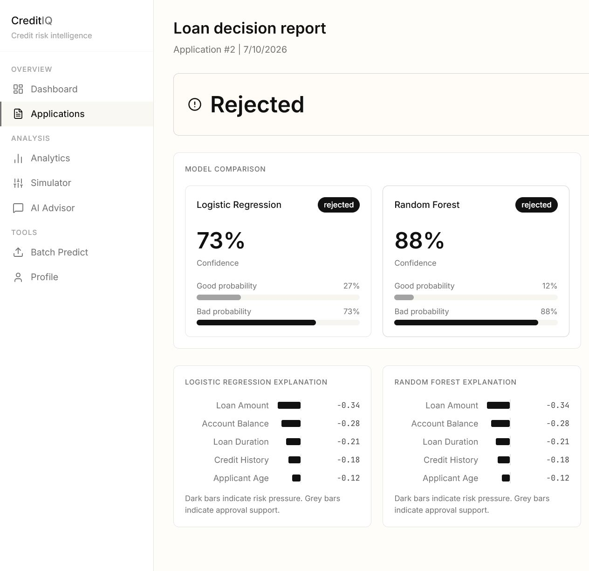
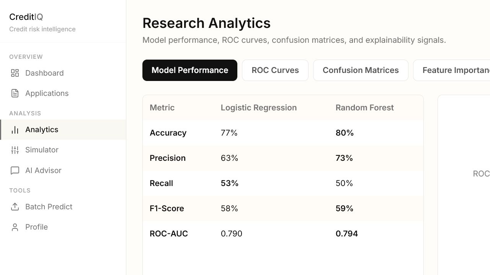
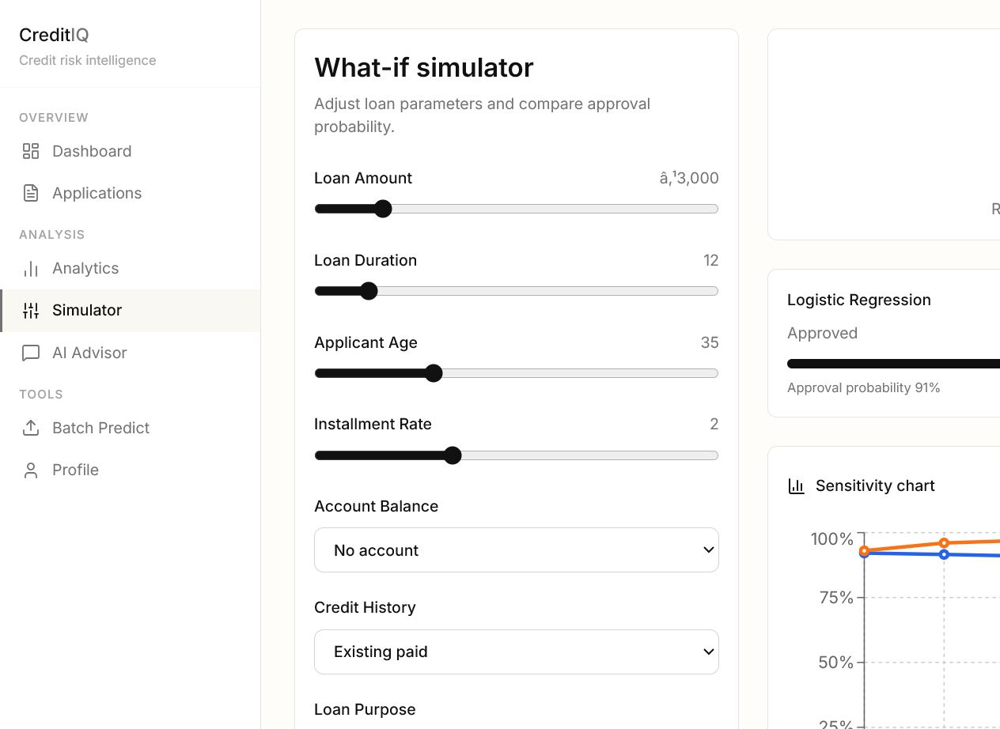
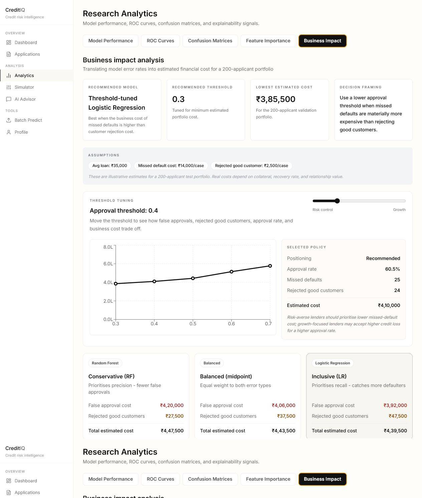
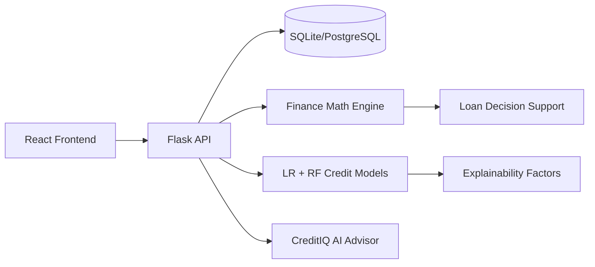

# CreditIQ

**AI-powered credit risk decision platform** — from raw applicant data to an explainable, cost-aware lending recommendation.

[](https://github.com/nayana3333/Credit-IQ/actions/workflows/ci.yml)
[](backend/requirements.txt)
[](frontend/package.json)
[](backend/requirements.txt)

CreditIQ scores loan applicants with two independent ML models, explains *why* each decision was made, and translates model errors into an estimated business cost — so the output isn't just "approve/reject," it's a defensible lending policy. It's built as a decision-support case study for lenders choosing between growth (approve more) and loss control (reject more borderline cases).

**Live demo:** [credit-iq-five.vercel.app](https://credit-iq-five.vercel.app) &nbsp;·&nbsp; demo login `demo@creditiq.com` / `demo12345`



## Contents

- [Key Features](#key-features)
- [Why This Project Exists](#why-this-project-exists)
- [Screenshots](#screenshots)
- [Architecture](#architecture)
- [Tech Stack](#tech-stack)
- [ML Results](#ml-results)
- [Explainability Validation](#explainability-validation)
- [Quick Start](#quick-start)
- [Demo User](#demo-user)
- [Database Migrations](#database-migrations)
- [Demo and Deployment](#demo-and-deployment)
- [Main API Endpoints](#main-api-endpoints)
- [Testing and Verification](#testing-and-verification)
- [Known Limitations and Roadmap](#known-limitations-and-roadmap)

## Key Features

**Risk scoring & explainability**
- **Dual-model scoring** — every application is scored by both Logistic Regression and Random Forest, trained on the UCI German Credit dataset, so a decision is never just one model's opinion.
- **SHAP-backed explanations** — each decision ships with the top factors driving it, checked for structural consistency and validated against 5 domain sanity checks ([details](#explainability-validation)).
- **Probability calibration** — confidence percentages are checked against actual outcome rates using Brier score and reliability diagrams, not just displayed at face value ([details](#ml-results)).

**Business decisioning**
- **Business impact analysis** — converts model errors (false approvals, wrongly rejected good customers) into an estimated portfolio cost in INR.
- **Threshold tuning** — compares approval rate, missed defaults, rejected good customers, and cost across risk thresholds to recommend the lowest-cost policy for a given risk appetite.
- **What-if simulation** — change any loan input and watch the approval probability move in real time.

**Applicant experience & ops**
- **3-step loan application flow** with a saved decision report: model confidence, probability bars, factor charts, and a recommendation.
- **Batch prediction** — score up to 100 applicants at once from a CSV upload, then export the results.
- **AI Credit Advisor** — chat interface with loan-context injection that explains decisions, factors, and simulations, and degrades to local fallback advice if no LLM key is configured.

## Why This Project Exists

CreditIQ is framed as a lender decision-support case study, not a standalone classifier demo: approve more customers for growth, or reject more borderline applications to control credit loss. The app turns model output into that tradeoff explicitly.

- **Problem** — reduce credit losses while preserving good-customer approvals.
- **Model layer** — Logistic Regression and Random Forest trained on German Credit data.
- **Evaluation layer** — accuracy, precision, recall, F1-score, ROC-AUC, confusion matrices, and feature importance.
- **Business layer** — cost assumptions convert model errors into estimated INR impact for a 200-applicant portfolio.
- **Recommendation layer** — threshold tuning identifies the lowest-cost policy and explains how the answer changes with risk appetite.
- **Stated limitation** — cost values are illustrative and should be recalibrated with a lender's actual recovery rate, margin, and customer lifetime value.

This project implements and extends ideas from:

- Khalid, S.R. (2025). "Machine learning-based credit scoring: A comparative analysis of logistic regression and random forest models." *International Journal of Financial Management and Economics*, 8(2):284-294.
- Teles, G. et al. (2019). "Machine learning and decision support system on credit scoring." *Neural Computing and Applications*.

## Screenshots

| Application Decision Report | Research Analytics |
| --- | --- |
|  |  |

| What-if Simulator | Business Impact |
| --- | --- |
|  |  |

## Architecture



Routes are code-split with `React.lazy`, so each page loads as its own chunk instead of one large bundle. The backend is a Flask app factory with blueprints per domain (auth, dashboard, loans, ml, assistant), a single `CreditApplication` table as the source of truth, and Alembic-managed schema migrations.

## Tech Stack

| Layer | Choices |
| --- | --- |
| Frontend | React, Vite, Tailwind CSS, Recharts, Lucide icons |
| Backend | Flask, SQLAlchemy, Flask-JWT-Extended, marshmallow request validation |
| Observability | Structured request logging and a global error handler ([`backend/app/logging_config.py`](backend/app/logging_config.py)) — every request and unexpected exception is logged without leaking stack traces to the client |
| Database | SQLite for local development; PostgreSQL via `DATABASE_URL`. Schema managed with Flask-Migrate/Alembic (`backend/migrations/`), not ad hoc `ALTER TABLE` patching |
| ML / Scoring | scikit-learn Logistic Regression, Random Forest, XGBoost benchmark, SHAP explainability |
| AI | OpenAI-compatible assistant route with context-aware local fallback |

## ML Results

Run `python backend/train_models.py` to reproduce local model artifacts. The analytics page reads `backend/model_metrics.pkl` and visualizes:

| Metric | Logistic Regression | Random Forest | XGBoost (benchmark) |
| --- | ---: | ---: | ---: |
| Accuracy | 71.5% | 77.5% | 76.5% |
| Precision | 51.8% | 70.3% | 63.3% |
| Recall | 73.3% | 43.3% | 51.7% |
| F1-Score | 60.7% | 53.6% | 56.9% |
| ROC-AUC | 0.7931 | 0.8074 | 0.8077 |

The four write-ups below are the actual engineering decisions and tradeoffs behind those numbers, not a polished-up summary — including the one place Random Forest got *worse* under a change that helped Logistic Regression.

<details>
<summary><b>Class imbalance handling</b> — why LR is reweighted and RF isn't</summary>

<br>

The German Credit dataset is ~70% good-credit / 30% bad-credit. Logistic Regression trains with `class_weight="balanced"`, which reweights the loss so misclassifying the minority (bad-credit) class costs more during training. This is a real, expected precision/recall tradeoff, not a regression: LR's recall on bad-credit applicants is far higher than RF's (73.3% vs 43.3%) at the cost of precision, while its ROC-AUC stays competitive with the other two models — confirming the model's underlying ability to separate good from bad applicants is intact, only where its decision boundary sits has moved.

Random Forest was also evaluated with `class_weight="balanced"` and `"balanced_subsample"`; both *reduced* its recall on this dataset (an ensemble's split-based weighting doesn't behave like a linear model's shifted decision boundary), so RF keeps its default (unweighted) training, and its precision/recall/business-cost tradeoff is instead controlled via the threshold tuning in the Business Impact page.

</details>

<details>
<summary><b>Hyperparameter tuning</b> — a 5-fold GridSearchCV, and why the "winner" changes depending on what you optimize for</summary>

<br>

All three models are tuned with a 5-fold `GridSearchCV` (`train_models.py`, `PARAM_GRIDS`), scoring on ROC-AUC since it's the threshold-independent metric used to judge separative power. Best params found: LR `C=0.01` (heavier regularization), RF `max_depth=10, min_samples_leaf=1, n_estimators=100`, XGBoost `learning_rate=0.1, max_depth=3, n_estimators=100`.

Two things worth calling out about the result:

1. Tuning optimizes ROC-AUC, not accuracy or recall — RF's ROC-AUC improved (0.7945 → 0.8074) but its accuracy *dropped* (79.5% → 77.5%) and recall dropped further (50.0% → 43.3%), because grid search doesn't know or care about the 0.5 decision threshold, only ranking quality.
2. After tuning, XGBoost's ROC-AUC (0.8077) very narrowly edges past Random Forest's (0.8074) — effectively a statistical tie. With default hyperparameters XGBoost had clearly under-performed RF; tuned, the two are indistinguishable. That's the actual lesson: an untuned model comparison isn't a fair verdict on which algorithm is "better" for a dataset — only a tuned comparison is.

Random Forest remains the production model regardless, since the tie doesn't justify switching away from the model everything else in this app (SHAP explainer, business-impact assumptions, tests) is built around.

</details>

<details>
<summary><b>XGBoost benchmark</b> — why it's shown but not wired into the live routes</summary>

<br>

`XGBClassifier` is trained and evaluated alongside LR/RF purely as a comparison point — it is not wired into the live prediction routes. The benchmark is shown in the Analytics page (Model Performance, ROC Curves, and Confusion Matrices tabs) for transparency.

</details>

<details>
<summary><b>Probability calibration</b> — a model can rank well and still lie about its own confidence</summary>

<br>

A model can rank applicants well (high ROC-AUC) while its raw probabilities are miscalibrated — i.e. a "70% confidence" prediction doesn't actually turn out right 70% of the time. Checked via `sklearn.calibration.calibration_curve` (quantile-binned reliability diagram, shown in the Analytics "Calibration" tab) and Brier score (lower is better; 0 = perfect, 0.25 = a coin flip): **LR scores 0.195, RF 0.157, XGBoost 0.156**.

LR is measurably overconfident — its reliability curve sits consistently above the diagonal, predicting higher bad-credit probabilities than actually occur. This is a real, expected side effect of `class_weight="balanced"` (used to improve LR's recall, see above): reweighting the loss shifts the decision boundary and distorts calibration. RF and XGBoost, trained unweighted, track the diagonal more closely.

Practical implication: LR's displayed "confidence %" is directionally useful but shouldn't be read as a literal probability — RF's better-calibrated confidence is one more reason it stays the production model.

</details>

## Explainability Validation

SHAP values are an approximation of feature contribution, not ground truth. This project validates them two ways: structural consistency, where every SHAP reason's direction label is checked against its impact sign, and domain sanity checks against representative loan profiles.

| Domain check | Result |
| --- | --- |
| High loan amount appears as a top rejection factor | Pass |
| Checking-status SHAP direction matches LR coefficient sign | Pass after ordinal encoding fix |
| Critical credit history sanity check | Pass |
| Young/unemployed profile flags employment as a risk factor | Pass |
| Small/short loan never shows credit amount as risk-increasing | Pass after domain calibration |

**5 of 5 domain checks pass.** The final fix keeps model probabilities unchanged but applies a presentation-layer monotonic sanity calibration for obvious low-risk extremes: near-minimum loan amounts and very short durations are not shown as risk-increasing explanation factors when their raw Random Forest SHAP approximation is a small non-monotonic artifact.

<details>
<summary><b>The encoding bug behind that first "Pass after ordinal encoding fix"</b></summary>

<br>

Ordinal features (`checking_status`, `savings_status`, `credit_history`, `employment`) were initially encoded with sklearn's `LabelEncoder`, which assigns codes by appearance order rather than true risk order. This made LR coefficients directionally ambiguous for these features. Switching to explicit ordinal mappings based on documented UCI German Credit semantics fixed the checking-status direction mismatch and improved Random Forest accuracy from 77.5% to 79.5% (ROC-AUC 0.78 → 0.79), since the model now learns from a more meaningful feature representation.

</details>

## Quick Start

Backend:

```bash
cd backend
python -m venv .venv
.venv\Scripts\activate
pip install -r requirements.txt
copy .env.example .env
set FLASK_APP=run.py
flask db upgrade
python train_models.py
python create_demo_user.py
python run.py
```

Frontend:

```bash
cd frontend
npm install
npm run dev
```

Open:

- Frontend: `http://127.0.0.1:5173`
- Backend health: `http://127.0.0.1:5000/api/v1/health`

## Demo User

The backend seeds a demo user with 5 sample credit applications:

- Email: `demo@creditiq.com`
- Password: `demo12345`

Run `python backend/create_demo_user.py` after `train_models.py` to seed this account if it doesn't already exist.

## Database Migrations

Schema changes go through Alembic via Flask-Migrate instead of hand-editing columns. After changing a model in `backend/app/models.py`:

```bash
cd backend
set FLASK_APP=run.py
flask db migrate -m "Describe the change"
flask db upgrade
```

Review the autogenerated script in `backend/migrations/versions/` before committing it — autogenerate detects table/column changes reliably but sometimes needs a manual nudge for renames or data backfills. Both `Dockerfile` and `docker-compose.yml` run `flask db upgrade` before starting the app, so deployments apply pending migrations automatically.

<details>
<summary><b>Schema consolidation</b> — why there's one <code>CreditApplication</code> table instead of three</summary>

<br>

An earlier version of this app had a `Loan` + `LoanDecision` table pair alongside `CreditApplication`, both storing essentially the same credit-decision data — every loan submission wrote to both. These have been merged into `CreditApplication` (which gained `loan_amount`/`emi`/`interest_rate` columns to cover what `Loan` used to own); `/api/v1/loans` remains as a read-only, backward-compatible view over the same table rather than a separate one.

</details>

## Demo and Deployment

Local demo steps are documented in [docs/DEMO_GUIDE.md](docs/DEMO_GUIDE.md). Deployment options are documented in [docs/DEPLOYMENT.md](docs/DEPLOYMENT.md).

Docker demo:

```bash
docker compose up --build
```

Then open `http://localhost:8080`. The backend container seeds the demo account against the same SQLite database used by the running Flask API.

## Main API Endpoints

| Area | Endpoint |
| --- | --- |
| Auth | `POST /api/v1/auth/register`, `POST /api/v1/auth/login`, `GET /api/v1/auth/profile` |
| Dashboard | `GET /api/v1/dashboard` |
| Applications | `GET /api/v1/ml/applications`, `GET /api/v1/ml/applications/:id` |
| Prediction | `POST /api/v1/ml/predict`, `POST /api/v1/ml/batch` |
| Analytics | `GET /api/v1/ml/metrics`, `GET /api/v1/ml/business-impact` |
| Simulation | `POST /api/v1/ml/simulate` |
| Assistant | `POST /api/v1/assistant/chat` |
| Health | `GET /api/v1/health` |

## Testing and Verification

```bash
cd backend
pytest -v
cd frontend
npm run build
```

Backend tests cover authentication, ML prediction responses, model quality, calibration, and SHAP/domain consistency checks, and run in CI on every push ([badge](https://github.com/nayana3333/Credit-IQ/actions/workflows/ci.yml) at the top of this file). The frontend build verifies React/Vite production bundling.

## Known Limitations and Roadmap

Documented here on purpose, not hidden — these are known tradeoffs, not oversights:

- **Business-impact cost figures are illustrative.** They demonstrate the threshold-tuning methodology, not calibrated real-world lending economics for a specific lender.
- **No pagination on `/api/v1/ml/applications`.** Fine for a demo dataset; would need cursor-based pagination before it saw production-scale traffic.
- **No automated retraining pipeline.** `train_models.py` is run manually; a production version would version datasets and models and retrain on a schedule or drift trigger.
- **Backend is not always deployed alongside the live frontend preview** — see [Quick Start](#quick-start) to run the full stack locally, or point `VITE_API_BASE_URL` at a deployed backend.
